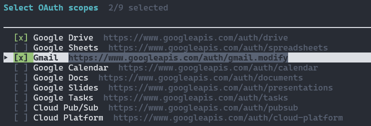

# coach-assist

## Quick Install

### macOS & Linux (Bash)
Create a directory and run the installer from there:
```bash
mkdir -p programs && cd programs
curl -sSL https://raw.githubusercontent.com/oldendick/coach-assist/main/install.sh | sh
```

### Windows (PowerShell)
Open PowerShell, create a directory, and run the installer:
```powershell
mkdir programs; cd programs
powershell -c "irm https://raw.githubusercontent.com/oldendick/coach-assist/main/install.ps1 | iex"
```

### 🍎 macOS Security (Manual Install)
If you download the `.zip` manually via a browser, macOS will label the app as "untrusted." 

**To fix this:**
1.  **Right-click** `coachassist` (and `bin/gws`) and select **Open**.
2.  Or, run this in your terminal to fix both binaries:
    ```bash
    xattr -r -d com.apple.quarantine coachassist
    xattr -r -d com.apple.quarantine bin/gws
    ```
*(If you used the `curl` installer at the top of this page, this is handled for you automatically!)*

---

## Windows Setup (Using Release) (Manual)

1. Download and extract the `.zip` file for your platform (e.g., `coach-assist-v1.0.0-windows-amd64.zip`).

1. Open a terminal (PowerShell or cmd.exe) and `cd` into the extracted folder.

1. **Configure GWS**: Place your `client_secret.json` in `C:\Users\<username>\.config\gws\client_secret.json`.

1. **Authenticate**: Run the following and follow the browser prompts:
   ```bash
   .\bin\gws.exe auth login
   ```
   Select the required permissions for Google Drive and Gmail:
   <br/>

1. **Start**: Run the application:
   ```bash
   .\coachassist.exe
   ```

---

## Developer: Releasing a New Version

Releases are automated via GitHub Actions.

1.  **Commit and Push** your changes to the `main` branch.
2.  **Tag the Version** (e.g., `v1.0.0`):
    ```bash
    git tag v1.0.0
    ```
3.  **Push the Tag**:
    ```bash
    git push origin v1.0.0
    ```

Once pushed, GitHub will automatically build binaries for all platforms, package them into optimized archives, and create a formal GitHub Release with all assets attached.

